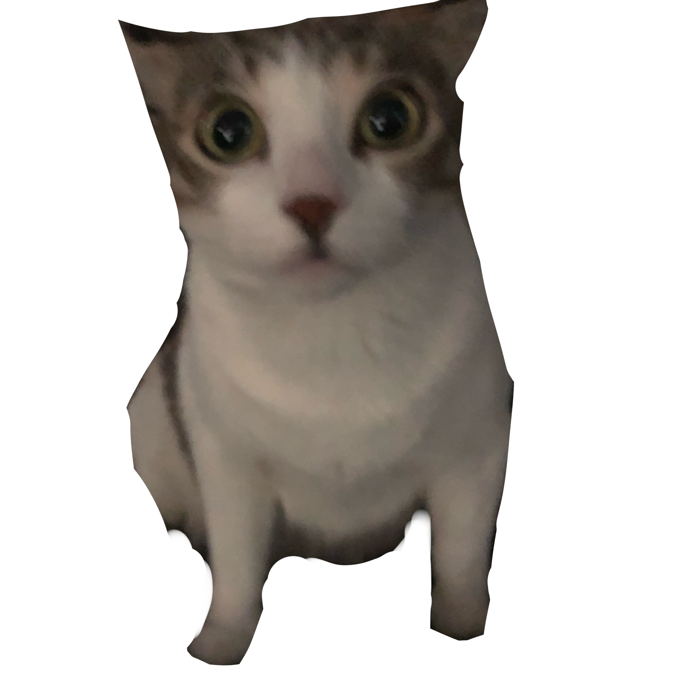
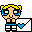

# fangs.cat

This is my personal webiste, deployed at [fangs.cat](https://fangs.cat/) with GitHub Pages!

Currently, it's a static page utilizing very simple HTML & CSS. I don't require a website at the moment, and most of my focus is put into more important projects. While I do have a lot of goals and ideas set forth, I usually add something miniscule every few months.

## Join the site!

All you'll need is an **88x31** image (.GIF preferred) and the ability to feature a link back to my site _somewhere_ on yours. You can fork this repo and open up a [pull request](https://github.com/catfxngs/fangs.cat/pulls) if you feel like it, or just shoot me an email with information about your page!

 [hi@fangs.cat](mailto:hi@fangs.cat)

I don't have a button yet, but it will be added soon. Here are some examples:

    

## Contribute

Whether you'd like to fix my typos, throw in some cool feature, or just clean up the mess, all contributions are welcome!
